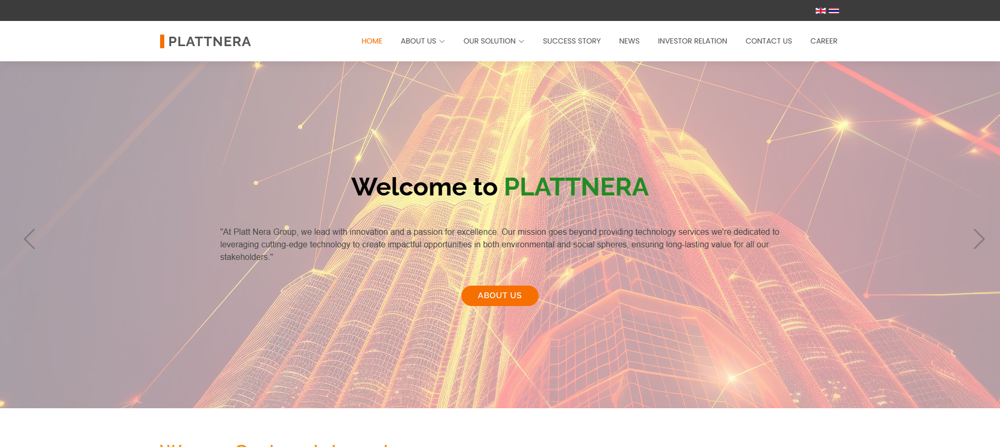
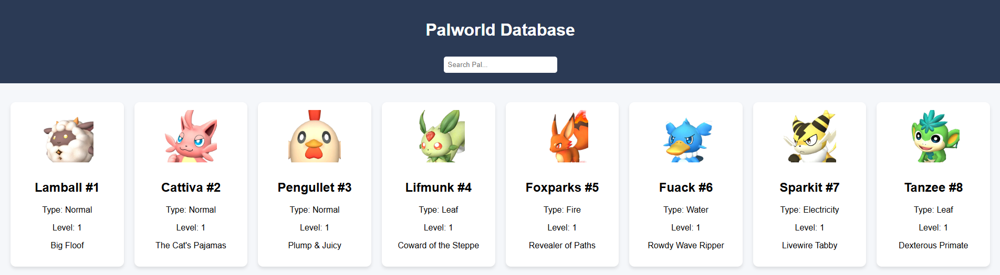

# Hi, I'm Nattakitti 👋

Frontend & Fullstack Developer | React, JavaScript, HTML/CSS

📫 Contact: nattakitti.work@gmail.com | [LinkedIn](https://www.linkedin.com/in/nattakit-matcha/)

---

## 🛠 Skills

**Frontend:** React, JavaScript, HTML, CSS, TailwindCSS  
**Backend:** Node.js, Express  
**Database:** MySQL, MongoDB  
**Tools:** Git, GitHub, VSCode, Postman  

---

## 📂 Projects

| Project | Description | Screenshot | Link |
|---------|-------------|------------|------|
| Personal Website | Showcasing projects and skills |  | [View](https://d-nattakitti.github.io/GithubWebsitePN/index.html) |
| Palworld Database | DB website with search, filter, and admin panel |  | [View](https://d-nattakitti.github.io/Palworld-DB/) |

---

## 📈 GitHub Stats & Badges

  
  
  

---

## 💡 Goals / What I’m Working On

- Building more React & Fullstack projects  
- Learning Next.js & advanced Node.js  
- Improving portfolio & resume for job applications  

---

## 📫 Contact

- **Email:** nattakitti.work@gmail.com  
- **LinkedIn:** [https://www.linkedin.com/in/nattakit-matcha/](https://www.linkedin.com/in/nattakit-matcha/)  
- **Portfolio:** [https://d-nattakitti.github.io/GithubWebsitePN/index.html](https://d-nattakitti.github.io/GithubWebsitePN/index.html)
